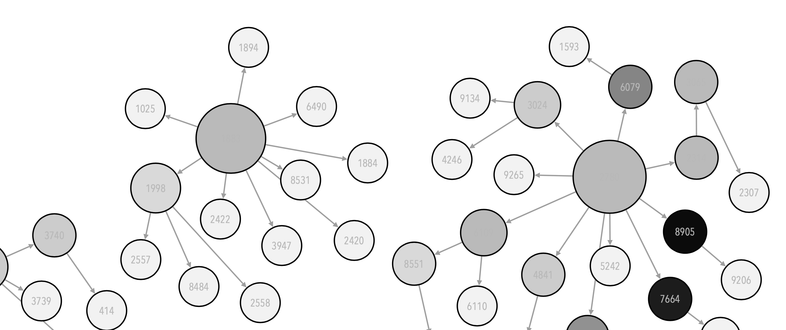

# Data Science Across Disciplines

This is the complementary page for the IM939 - Data Science Across Disciplines module that is being run at the Centre for Interdisciplinary Methodologies at the University of Warwick.

## What this module is about?  

This module introduces students to the fundamental techniques, concepts and contemporary discussions across the broad field of data science. With data and data related artefacts becoming ubiquitous in all aspects of social life, data science gains access to new sources of data, is taken up across an expanding range of research fields and disciplines, and increasingly engages with societal challenges. The module provides an advanced introduction to the theoretical and scientific frameworks of data science, and to the fundamental techniques for working with data using appropriate procedures, algorithms and visualisation. Students learn how to critically approach data and data-driven artefacts, and engage with and critically reflect on contemporary discussions around the practice of data science, its compatibility with different analytics frameworks and disciplinary, and its relation to on-going digital transformations of society. As well as lectures discussing the theoretical, scientific and ethical frameworks of data science, the module features coding labs and workshops that expose students to the practice of working effectively with data, algorithms, and analytical techniques, as well as providing a platform for reflective and critical discussions on data science practices, resulting data artefacts and how they can be interpreted, actioned and influence society.

### Module Schedule  

#### Session-01: INTRODUCTION, HISTORICAL PERSPECTIVES & BASIC CONCEPTS 

This week discusses data science as a field that cuts across disciplines and provides a historical perspective on the subject. 

[Session details and material](Sessions/session-01.html) 

#### Session-02: THINKING DATA: THEORETICAL AND PRACTICAL CONCERNS 

This week explores the cultural, ethical, and critical challenges posed by data artefacts and data-intensive scientific processes. Engaging with Critical Data Studies, we discuss issues around data capture, curation, data quality, inclusion/exclusion and representativeness. The session also discusses the different kinds of data that one can encounter across disciplines, the underlying characteristics of data and how we can analytically and practically approach data quality issues and the challenge of identifying and curating appropriate data sets.

The practical lab session walks students through the earlier stages of the data science process. We start by looking at different types of data suitable for analysis within a data science framework and move on to how to wrangle the data to make it available for further use.

#### Session-03: ABSTRACTIONS & MODELS 

This week discusses ways of abstracting data. We start by visiting statistics as a means of representing data and its inherent characteristics. The session moves on to discuss the notion of a “model” and visit the different schools of thought within model-ing, as well as a tour of fundamental statistical models that help abstract data and its inherent relations.

The practical part explores processing data and data transformations, summarizing data through descriptive statistics, the case of outliers and a brief overview of robust statistics, as well as investigating relations within different aspects of the data and explore concepts such as correlation, regression, and their relevance within different disciplinary frameworks.

#### Session-04: STRUCTURES AND SPACES 

This week explores the notion of structures and how data science can enable the extraction of “hidden” underlying groups – clusters -- and hierarchical structures from data. We discuss the different techniques to surface and generate artificial boundaries and how the resulting artefacts can be interpreted. This session then investigates how artificial and abstract spaces can be constructed through different “projection” techniques, and how these spaces help us navigate data that are high-dimensional in nature and apply analytic frameworks to them.

The practical lab explores the use of clustering techniques, compares alternatives, and discusses interpretability issues, and we also review how we can deal with data sets that consists of several variables.

#### Session-05: MULTI-MODEL THINKING AND RIGOUR IN DATA SCIENCE 

This week we focus on multi-model approaches as a way of thinking and how critical, pluralistic thinking can improve our understanding of the underlying phenomena implicit in data. We also discuss how to adopt a comprehensive approach to the data science process, and investigate indicators of rigor in data science.

The practical session involves combining perspectives derived from different computational models, as well as considering how diverse theoretical frameworks can help us approach phenomena of interest in different ways.

#### Session-06: RECOGNISING AND AVOIDING TRAPS 

This week we discuss how we can be aware of various methodological and ethical traps and pitfalls that one can encounter during the data science process. We will discuss causality and when and to what extent it can be expected and observed, we will touch upon statistical traps such as Base-rate fallacy / prosecutor's fallacy, Simpson's paradox, as well as how visualisations can deceive and how to avoid representational traps.

The practical session involves hands-on examples where such traps are encountered and responded.

#### Session-07: DATA SCIENCE & SOCIETY 

We will engage with academic and practices discourse on the social, cultural and ethical aspects of data science, and discuss around how one can responsibly carry out data science research on social phenomena, whether data science can be a transformative power in society, and what ethical and social frameworks can help us to critically approach data science practices and its effects on society, and what are ethical practices for data scientists.

#### Session-08: DATA SCIENCE WORKSHOP - 1 (DESIGN THINKING IN DATA SCIENCE)

This week explores the question “Can we approach data science as a design problem?” and discusses how one can embrace a user-centred approach to design appropriate data science processes. We will do this through hands-on practical where we go through the data science process over applied cases.

Further notes: This week explores the question “Can we approach data science as a design problem?” and discusses how one can embrace a user-centred approach to design appropriate data science processes. We will explore how design thinking can inform and influence how we approach underlying problems, understand the interests and investments of different disciplines and expert stakeholders and how this can inform the design of analytic frameworks and disciplines accordingly.

#### Session-09: DATA SCIENCE WORKSHOP - 2 

This week will involve hands-on practical where we go through the data science process over applied examples. During the workshop, we will explore concepts such as reproducibility, openness and transparency and how best to communicate the analytical and reasoning process as well as critically reflecting on the various data artefacts produced. We will also explore concepts such as narrative and visual storytelling, as well as reflect on the design process for our analysis and artefacts.